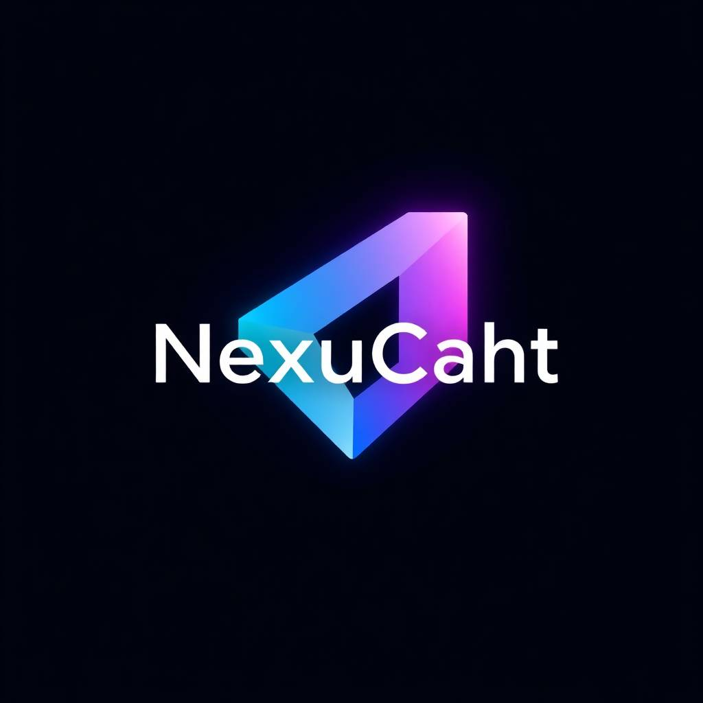

# NexusChat
**NexusChat** is a modern, lightweight, and real-time chat application built with Golang and powered by NATS for seamless messaging. Designed with simplicity and efficiency in mind, NexusChat allows users to join a chatroom, send and receive messages instantly, and view active participants using a sleek command-line interface (CLI). It’s an elegant solution for real-time communication, combining modular architecture, high performance, and a focus on user experience.
## Tech Stack

**Client:** Go

**Server:** Go, Postgresql, NATS

## License

[MIT](https://choosealicense.com/licenses/mit/)

## Contributing

Contributions are always welcome!

See contributing.md for ways to get started.

Please adhere to this project's code of conduct.
